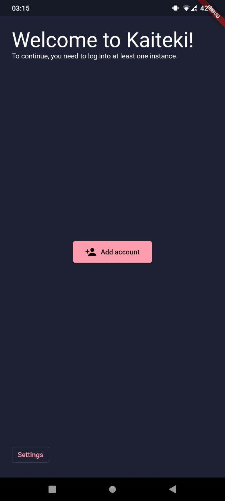
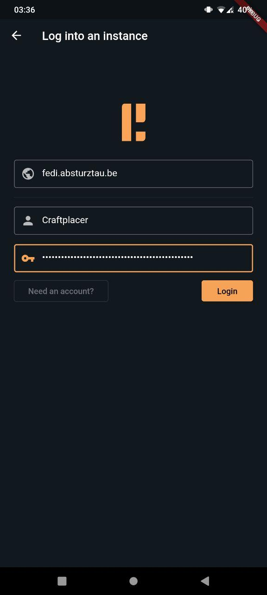
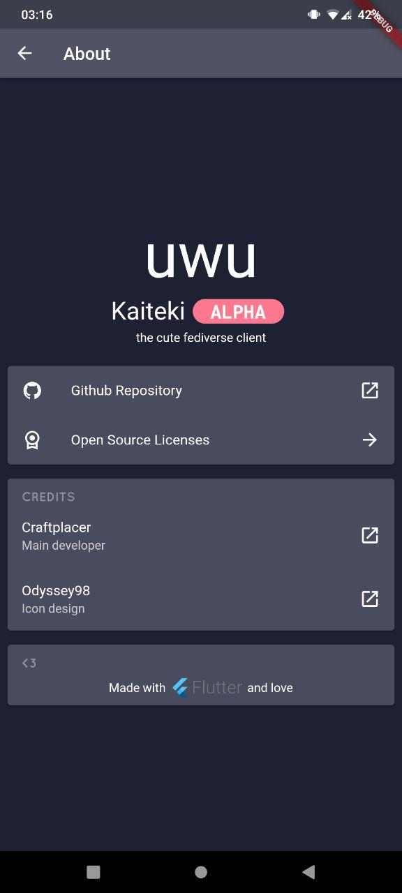

# 


A Fediverse client for micro-blogging instances written in Flutter/Dart.

Currently Kaiteki has simple Mastodon/Pleroma and Misskey support, future backends could follow.

I'm happy about any feedback or contribution you have.

## Screenshots

| Welcome page | Login page | Feed of a Pleroma instance | Feed of a Misskey instance | About page |
| - | - | - | - | - |
|  |  |  |  |  |

# What's working, what's missing?

Currently Kaiteki only allows viewing timelines. Estimated, most important API calls for Misskey, Pleroma/Mastodon are already implemented, but lack proper internal adapter design, alongside their user interface.

## Download and use Kaiteki

If you want to try out Kaiteki, there are automatic releases available for use.

Please still note, that **Kaiteki is still in development**.
Unpolished code, bugs and missing features might be present in these builds, so think twice when creating issues.

[][1]

[1]: https://craftplacer.github.io/kaiteki/


### Why isn't my platform available?

Android APKs, Packaged Linux releases and Windows builds are yet to be integrated into the GitHub build and deploy workflow.

Apple based platforms won't get any support, until one user will offer building and maintaining those builds.

## Compiling Kaiteki

Depending on your platform you might have to take extra steps.
See [this page for steps on compiling for desktop](https://flutter.dev/desktop#requirements), and [this page for steps on compiling for web](https://flutter.dev/docs/get-started/web).

```sh
flutter upgrade # upgrade flutter to its latest version
flutter pub get # get packages

# run (debug)
flutter run
# or build (release)
flutter build apk
flutter build windows
flutter build linux
flutter build web
# and so on...
```
